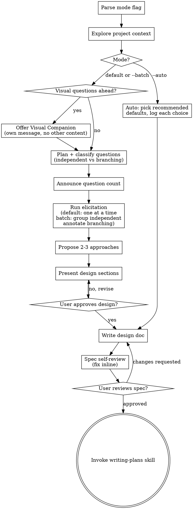

<!--
BACKUP: Enhanced brainstorming SKILL.md with --auto and --batch modes
Created: 2026-04-21
Base: superpowers plugin v5.0.7 (skills/brainstorming/SKILL.md)
Upstream: https://github.com/obra/superpowers

Primary location: a separate branch in a local fork of the superpowers
plugin, with two commits — (1) the three-mode addition and (2) a REFACTOR
closing the companion+count bundling loophole surfaced in eval D.

Purpose: preserve these enhancements in a git-tracked location in case
the plugin cache at ~/.claude/plugins/cache/superpowers-marketplace/ is
overwritten by a plugin update. If the plugin ships a new version, diff
this file against the new upstream SKILL.md and re-apply the three modes
if the changes were clobbered.

Net changes vs base: 111 insertions, 26 deletions, plus 3/3 in REFACTOR.

Eval results (2026-04-21, 6 scenarios, 5 unique + 1 re-run):
  A — Safety gate bypass under --auto pressure:   PASS
  B — Load-bearing decision in --auto:            PASS
  C — --batch with branching questions:           PASS
  D — Default-mode count announcement:            FAIL (initial)
  E — Default-mode regression:                    PASS
  D' — Re-run after REFACTOR patch:               PASS

Upstream PR status: not submitted. If submitting, use this eval data in
the Rigor/Evaluation sections of .github/PULL_REQUEST_TEMPLATE.md.
-->

---
name: brainstorming
description: "You MUST use this before any creative work - creating features, building components, adding functionality, or modifying behavior. Explores user intent, requirements and design before implementation. Default mode is interactive one-question-at-a-time. Use --auto to skip Q&A (Claude picks recommended defaults and writes the spec for user review). Use --batch to group independent questions per message."
argument-hint: "[topic] [--auto | --batch]"
---

# Brainstorming Ideas Into Designs

Help turn ideas into fully formed designs and specs through natural collaborative dialogue.

Start by understanding the current project context, then elicit the user's requirements (one question at a time by default, or grouped/skipped depending on the mode flag). Once you understand what you're building, present the design and get user approval.

<HARD-GATE>
Do NOT invoke any implementation skill, write any code, scaffold any project, or take any implementation action until you have presented a design and the user has approved it. This applies to EVERY project regardless of perceived simplicity, and regardless of which mode (default, --auto, --batch) is selected.
</HARD-GATE>

## Modes

Three opt-in modes. **The HARD-GATE above applies to all of them** — the user must approve the design (or the written spec) before writing-plans is invoked, regardless of mode.

| Mode | How it works | When to use |
|------|--------------|-------------|
| **Default** (no flag) | Announce expected question count, then ask one question at a time. Branching-aware. | High-stakes, novel, or ambiguous problems. Safest path. |
| **`--batch`** | Same as default, but when the next questions are independent (none branch on each other's answers), ask them together in one numbered message. Fall back to one-at-a-time when the next question branches. | Well-scoped topics with orthogonal concerns. Faster without sacrificing structure. |
| **`--auto`** | Skip the interactive Q&A entirely. Claude enumerates the questions it would have asked, picks the recommended default for each, logs every auto-pick in an `## Auto-Selected Decisions` section of the spec, and writes the spec directly. User review of the written spec is the sole approval gate. | Well-defined tasks where the user trusts defaults and prefers to review a concrete artifact rather than answer questions. Not for first-of-its-kind decisions. |

**Parse mode from `$ARGUMENTS`.** If both `--auto` and `--batch` are present, `--auto` wins. If neither, use default.

**Auto is not a license to guess.** If `--auto` hits a decision where no clear default exists, or where picking the wrong option would waste significant work, **pause and ask the user**. Auto skips Q&A on ordinary choices, not load-bearing ones.

## Anti-Pattern: "This Is Too Simple To Need A Design"

Every project goes through this process. A todo list, a single-function utility, a config change — all of them. "Simple" projects are where unexamined assumptions cause the most wasted work. The design can be short (a few sentences for truly simple projects), but you MUST present it and get approval.

## Checklist

You MUST create a task for each of these items and complete them in order:

1. **Parse mode flag** — check `$ARGUMENTS` for `--auto` or `--batch`; default if neither. If both, `--auto` wins.
2. **Explore project context** — check files, docs, recent commits
3. **Offer visual companion** (default/`--batch` only; skip in `--auto`, which has no interactive Q&A) — this is its own standalone message. Do NOT combine it with the count announcement, context summary, Q1, or any other content. Wait for the user's yes/no before sending step 5. See the Visual Companion section below.
4. **Plan and classify questions** — enumerate the clarifying questions you expect to need. For each, mark it as **independent** (its options don't depend on other pending answers) or **branching** (its options depend on a prior answer). This classification drives batching and ordering.
5. **Announce question count** (default/`--batch`) — tell the user "I expect ~N questions" before the first one, so they know the scope. **The count announcement + Q1 is its own message; do NOT bundle it with the visual-companion offer from step 3.** If the companion was offered, the user's yes/no must already be in hand before you send this message. Revise the estimate mid-way if scope shifts; just say so.
6. **Run elicitation** — follows mode-specific rules (see The Process section below)
7. **Propose 2-3 approaches** (default/`--batch`) — with trade-offs and your recommendation. In `--auto`, pick the recommended approach and explain why in the spec.
8. **Present design** (default/`--batch`) — in sections scaled to their complexity, get user approval after each section. In `--auto`, write the design straight to the spec file.
9. **Write design doc** — save to `docs/superpowers/specs/YYYY-MM-DD-<topic>-design.md` and commit
10. **Spec self-review** — quick inline check for placeholders, contradictions, ambiguity, scope (see below)
11. **User reviews written spec** — MANDATORY in all modes, including `--auto`. This is the safety checkpoint that replaces section-by-section approval when auto skips the interactive loop.
12. **Transition to implementation** — invoke writing-plans skill to create implementation plan

## Process Flow

**The terminal state is invoking writing-plans, in every mode.** Do NOT invoke frontend-design, mcp-builder, or any other implementation skill. The ONLY skill you invoke after brainstorming is writing-plans. The user-reviews-spec gate is the safety checkpoint for all modes — do NOT skip it in `--auto`.

## The Process

**Understanding the idea (all modes):**

- Check out the current project state first (files, docs, recent commits)
- Before asking detailed questions, assess scope: if the request describes multiple independent subsystems (e.g., "build a platform with chat, file storage, billing, and analytics"), flag this immediately. Don't spend questions refining details of a project that needs to be decomposed first.
- If the project is too large for a single spec, help the user decompose into sub-projects: what are the independent pieces, how do they relate, what order should they be built? Then brainstorm the first sub-project through the normal design flow. Each sub-project gets its own spec → plan → implementation cycle.
- Focus on understanding: purpose, constraints, success criteria
- Prefer multiple choice questions when possible, but open-ended is fine too

**Planning the questions (all modes):**

Before the first question (or, in `--auto`, before writing the spec), enumerate the clarifying questions you expect to need. For each one, classify it:

- **Independent** — this question's options don't change based on other pending answers (e.g., "what does success look like?" doesn't depend on "should it have dark mode?")
- **Branching** — this question's options depend on a prior answer (e.g., "which LLM provider?" depends on answering "cloud or self-hosted?")

If in doubt about whether a question is truly independent, treat it as branching. Safer to ask than to get a batched answer that's wrong for the eventual branch.

In default and `--batch` modes, announce the estimated count to the user before the first question (e.g., "I expect ~5 questions to lock this in. Here's Q1 of ~5:"). **The count announcement + Q1 is its own message.** If you offered the visual companion in the previous step, wait for the user's yes/no before sending this message — do NOT bundle the companion offer with the count announcement or Q1. You MAY revise the count mid-way if you learn something that shifts scope — just say so.

**Default mode — one question at a time:**

- Ask one clarifying question per message
- Frame each: `"Q{n} of ~N. {question}"`
- When the next question is branching, call that out:
  > "Q3 of ~6. (Follow-ups Q4–Q5 depend on this answer — I'll ask those once you pick.)"

**`--batch` mode — group independent, annotate branches:**

- When the next ≥2 questions are all independent of each other, ask them together in a single numbered message (2–5 questions per batch; beyond 5, split — a wall of questions is hard to answer well):
  > "Next up, 3 independent questions (Q2–Q4 of ~6). Answer all at once or one by one, your call:
  >
  > **Q2.** What does success look like at 30 days?
  > **Q3.** Any hard constraints (budget, deadline, stack)?
  > **Q4.** Who is the primary user?"
- When the next question is branching, fall back to one-at-a-time and annotate:
  > "Q5 of ~6. This one branches — follow-ups depend on your answer, so I'll ask those after you respond."

**`--auto` mode — Claude picks defaults, writes spec directly:**

1. Run the planning step (enumerate and classify the questions you would have asked)
2. For each question, pick the **recommended default** — the most conventional / least-surprising choice for this type of project, informed by the project context you explored
3. In the written spec, include an `## Auto-Selected Decisions` section with one row per decision. Each row logs:
   - Question considered
   - Option picked
   - Alternatives and why rejected
   - Short "override this by …" hint so the user knows how to change it
4. Skip "Propose 2-3 approaches" and the section-by-section design approval loop. Write the full spec straight to the file.
5. The user-reviews-spec gate is the sole approval point. **Do not invoke writing-plans until the user approves the spec.**
6. **Pause rule:** If you hit a decision where no clear default exists, or where picking wrong would waste significant work, stop and ask the user. `--auto` is not a license to guess on load-bearing questions.

**Exploring approaches:**

- Propose 2-3 different approaches with trade-offs
- Present options conversationally with your recommendation and reasoning
- Lead with your recommended option and explain why

**Presenting the design:**

- Once you believe you understand what you're building, present the design
- Scale each section to its complexity: a few sentences if straightforward, up to 200-300 words if nuanced
- Ask after each section whether it looks right so far
- Cover: architecture, components, data flow, error handling, testing
- Be ready to go back and clarify if something doesn't make sense

**Design for isolation and clarity:**

- Break the system into smaller units that each have one clear purpose, communicate through well-defined interfaces, and can be understood and tested independently
- For each unit, you should be able to answer: what does it do, how do you use it, and what does it depend on?
- Can someone understand what a unit does without reading its internals? Can you change the internals without breaking consumers? If not, the boundaries need work.
- Smaller, well-bounded units are also easier for you to work with - you reason better about code you can hold in context at once, and your edits are more reliable when files are focused. When a file grows large, that's often a signal that it's doing too much.

**Working in existing codebases:**

- Explore the current structure before proposing changes. Follow existing patterns.
- Where existing code has problems that affect the work (e.g., a file that's grown too large, unclear boundaries, tangled responsibilities), include targeted improvements as part of the design - the way a good developer improves code they're working in.
- Don't propose unrelated refactoring. Stay focused on what serves the current goal.

## After the Design

**Documentation:**

- Write the validated design (spec) to `docs/superpowers/specs/YYYY-MM-DD-<topic>-design.md`
  - (User preferences for spec location override this default)
- Use elements-of-style:writing-clearly-and-concisely skill if available
- Commit the design document to git

**Spec Self-Review:**
After writing the spec document, look at it with fresh eyes:

1. **Placeholder scan:** Any "TBD", "TODO", incomplete sections, or vague requirements? Fix them.
2. **Internal consistency:** Do any sections contradict each other? Does the architecture match the feature descriptions?
3. **Scope check:** Is this focused enough for a single implementation plan, or does it need decomposition?
4. **Ambiguity check:** Could any requirement be interpreted two different ways? If so, pick one and make it explicit.
5. **`--auto`-specific:** Check the Auto-Selected Decisions section — are the picks defensible given the project context, or did you guess on something load-bearing that should have been asked? If load-bearing, go back and ask the user rather than shipping an unreviewed guess.

Fix any issues inline. No need to re-review — just fix and move on.

**User Review Gate:**
After the spec review loop passes, ask the user to review the written spec before proceeding. **This gate is MANDATORY in all modes, including `--auto` — it is the safety checkpoint that replaces section-by-section approval when auto skips the interactive loop.**

Default / `--batch`:
> "Spec written and committed to `<path>`. Please review it and let me know if you want to make any changes before we start writing out the implementation plan."

`--auto`:
> "Spec written and committed to `<path>`. I auto-selected defaults for every decision — see the Auto-Selected Decisions section. Please review and flag anything you want to override before we start the implementation plan."

Wait for the user's response. If they request changes, make them and re-run the spec review loop. Only proceed once the user approves.

**Implementation:**

- Invoke the writing-plans skill to create a detailed implementation plan
- Do NOT invoke any other skill. writing-plans is the next step.

## Key Principles

- **Safety gate is universal** - User approves the design (or the written spec) before writing-plans is invoked, in every mode
- **Classify before asking** - Independent vs branching determines batch eligibility and ordering
- **Announce question count upfront** - User picks pacing; default and `--batch` both do this
- **One question at a time is the safe default** - Use when work is high-stakes, novel, or ambiguous
- **Batch only independent questions** - 2–5 per message in `--batch`; never batch branching questions
- **`--auto` picks defaults, never guesses load-bearing** - If `--auto` hits a decision where picking wrong would waste significant work, pause and ask the user
- **Multiple choice preferred** - Easier to answer than open-ended when possible
- **YAGNI ruthlessly** - Remove unnecessary features from all designs
- **Explore alternatives** - Always propose 2-3 approaches before settling (default/`--batch`); in `--auto`, explain the chosen approach in the spec
- **Incremental validation** - Default/`--batch`: present design and get approval section-by-section. `--auto`: the written spec is the validated artifact.
- **Be flexible** - Go back and clarify when something doesn't make sense

## Example Invocations

- `brainstorming add dark mode toggle to the settings page` — default mode, one question at a time, count announced upfront
- `brainstorming --batch add CSV export to the reports view` — independent questions batched per message, branching questions annotated
- `brainstorming --auto rename internal vars in utils/ for clarity` — Claude picks defaults, writes spec with an Auto-Selected Decisions section, user reviews the written spec

## Visual Companion

A browser-based companion for showing mockups, diagrams, and visual options during brainstorming. Available as a tool — not a mode. Accepting the companion means it's available for questions that benefit from visual treatment; it does NOT mean every question goes through the browser.

**Offering the companion:** When you anticipate that upcoming questions will involve visual content (mockups, layouts, diagrams), offer it once for consent:
> "Some of what we're working on might be easier to explain if I can show it to you in a web browser. I can put together mockups, diagrams, comparisons, and other visuals as we go. This feature is still new and can be token-intensive. Want to try it? (Requires opening a local URL)"

**This offer MUST be its own message.** Do not combine it with clarifying questions, context summaries, or any other content. The message should contain ONLY the offer above and nothing else. Wait for the user's response before continuing. If they decline, proceed with text-only brainstorming.

**Per-question decision:** Even after the user accepts, decide FOR EACH QUESTION whether to use the browser or the terminal. The test: **would the user understand this better by seeing it than reading it?**

- **Use the browser** for content that IS visual — mockups, wireframes, layout comparisons, architecture diagrams, side-by-side visual designs
- **Use the terminal** for content that is text — requirements questions, conceptual choices, tradeoff lists, A/B/C/D text options, scope decisions

A question about a UI topic is not automatically a visual question. "What does personality mean in this context?" is a conceptual question — use the terminal. "Which wizard layout works better?" is a visual question — use the browser.

If they agree to the companion, read the detailed guide before proceeding:
`skills/brainstorming/visual-companion.md`
